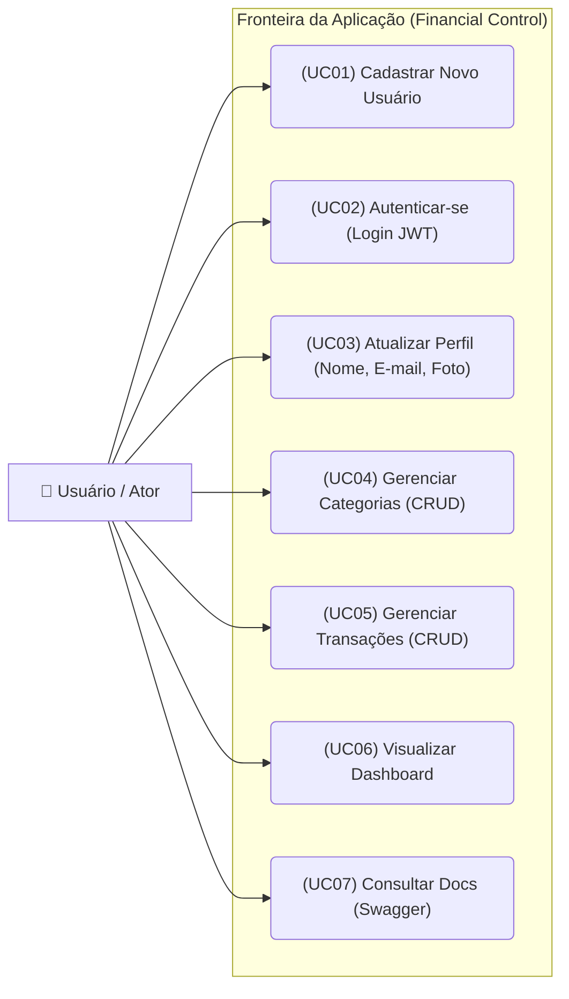
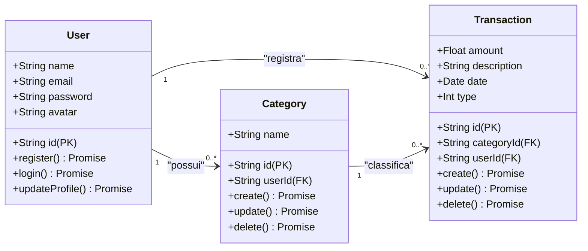
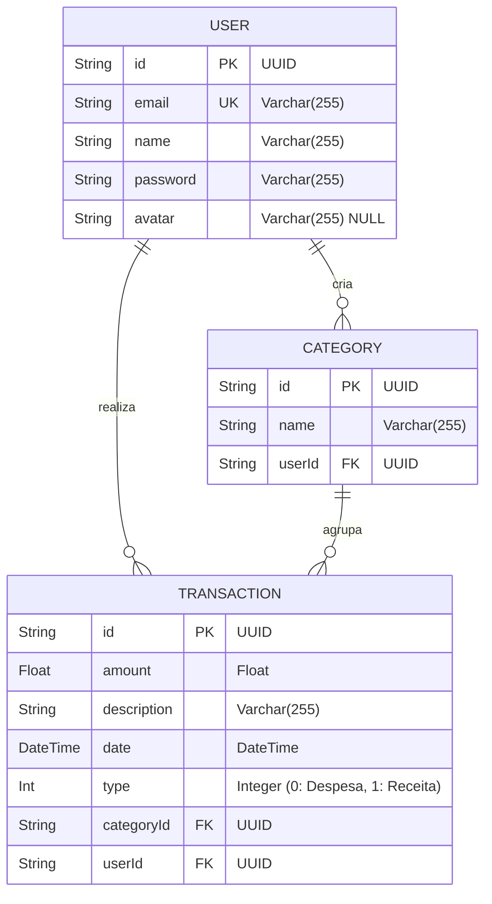
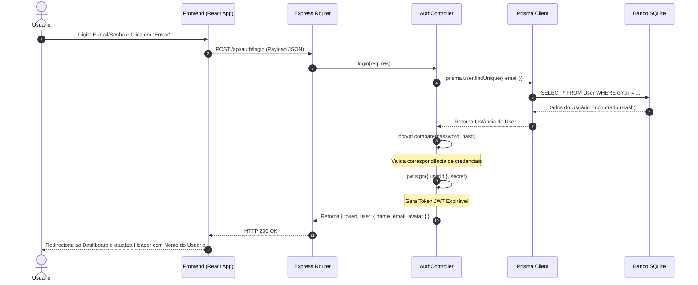

# 📄 Software Requirements Specification (SRS) - Financial Control

## 1. Introdução
Este documento detalha as especificações técnicas de software para o **Financial Control**. Apresenta a infraestrutura arquitetural, os requisitos do sistema e os diagramas UML e lógicos que governam o comportamento e a estrutura da aplicação.

---

## 2. Requisitos do Sistema

### 2.1 Requisitos Funcionais (RF)
*   **RF-01 (Autenticação):** O sistema deve permitir que os usuários se registrem e façam login com e-mail e senha segura, gerando um token JWT.
*   **RF-02 (Gestão de Perfil):** O usuário autenticado deve poder editar seu nome, e-mail e avatar/foto de perfil de forma persistente.
*   **RF-03 (CRUD de Transações):** O sistema deve oferecer inserção, leitura, atualização e exclusão completa de transações financeiras (receitas e despesas).
*   **RF-04 (CRUD de Categorias):** O sistema deve gerenciar categorias de gastos personalizáveis de forma independente e integrada.
*   **RF-05 (Categorização Dinâmica):** Ao criar uma transação digitando um nome de categoria novo, o backend deve criar a categoria de forma autônoma e associar o respectivo ID na transação.
*   **RF-06 (Painel Financeiro / Dashboard):** A aplicação deve calcular e mostrar o saldo acumulado total, as receitas e despesas agregadas dinamicamente.
*   **RF-07 (Documentação Interativa):** A API deve dispor de uma interface interativa Swagger na rota `/api-docs` listando todas as assinaturas operacionais.

### 2.2 Requisitos Não Funcionais (RNF)
*   **RNF-01 (Segurança de Acesso):** As senhas dos usuários devem ser criptografadas no banco usando hash seguro do pacote `bcrypt`.
*   **RNF-02 (Persistência Leve):** A persistência física deve utilizar o mecanismo relacional embarcado SQLite, facilitando execução zero-config.
*   **RNF-03 (Desempenho da API):** O tempo de resposta para qualquer CRUD básico deve ser inferior a 200 milissegundos sob conexões de internet estáveis.
*   **RNF-04 (Portabilidade e Deploy):** A infraestrutura deve suportar empacotamento completo usando contêineres Docker (`docker-compose`).
*   **RNF-05 (Integridade de Dados):** O banco de dados deve forçar regras de integridade referencial, como remoção de dependências em cascata (`onDelete: Cascade`) em transações ao excluir categorias ou usuários.

---

## 3. Arquitetura do Sistema
O sistema adota uma arquitetura em duas camadas principais (**Client-Server**):

1.  **Frontend (Camada de Apresentação):** Uma aplicação Single Page Application (SPA) reativa construída com React, TypeScript e TailwindCSS. Utiliza context providers de estado global para controlar o fluxo de autenticação e comunicação com os recursos REST.
2.  **Backend (Camada de Serviço e Negócio):** Um servidor REST API com Node.js e Express, utilizando o padrão Controller-Route.
3.  **Persistência (Banco de Dados):** Banco relacional SQLite manipulado programaticamente via Prisma ORM, garantindo migrations estruturadas e tipagem estrita de consultas.

---

## 4. Diagramas de Engenharia de Software

### 4.1 Diagrama de Casos de Uso
Demonstra a interação do ator (Usuário) com as principais fronteiras operacionais da aplicação:

---

### 4.2 Diagrama de Classes (Domínio de Negócio)
Representa as classes lógicas presentes no domínio de negócio do backend e suas relações multiplicativas:

---

### 4.3 Diagrama Entidade-Relacionamento (DER Lógico)
Descreve a estrutura física das tabelas do banco de dados relacional gerado pelo Prisma:

---

### 4.4 Diagrama de Sequência: Fluxo de Autenticação (Login)
Ilustra as mensagens e invocações de métodos necessárias para efetuar o login JWT no sistema:

